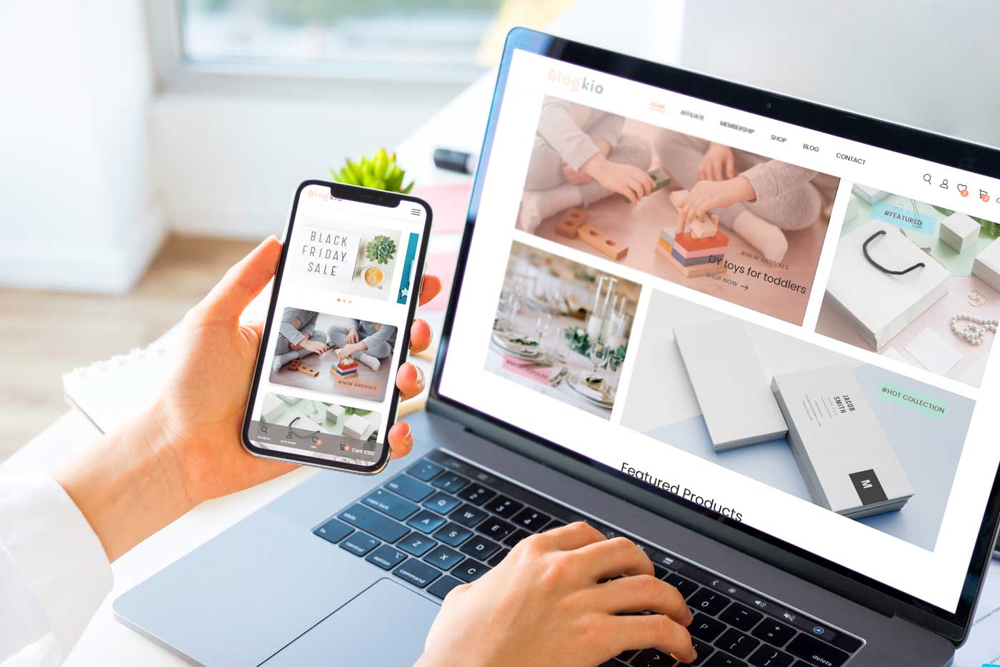

<h1>Responsive E-commerce website using Etsy restful API</h1> 
<h2>What's include in this landing page:</h2>
<ul>
<li>Responsive e-commerce product homepage Using HTML, CSS and JavaScript.</li>
<li>Loading data from external API (from etsy-shop).</li>
<li>Was designed and developed with the methodology "Mobile First", then for desktop.</li>
<li>Compatible with all mobile devices and with a beautiful and pleasant user interface.</li>
<li>adobe XD UI file included </li> 
  
  / === THIS API CAN NOT GET ACCES TO IMAGES JUST DATA LIKE (price, title, description, etc)

  
</ul>
<h2>Responsive presentation of the project</h2>

Join to my Youtube channel to see more tutorials videos, tips and more about UI/UX and code. 
<a href="https://www.youtube.com/c/DesignWeblondon"> AlexandersStudio</a>

<h2>🎥 Wacth live website 👇👇</h2>

>>Link: https://e-commerce-etsy.netlify.app/

